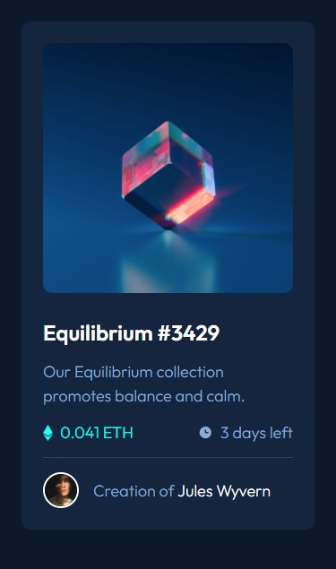
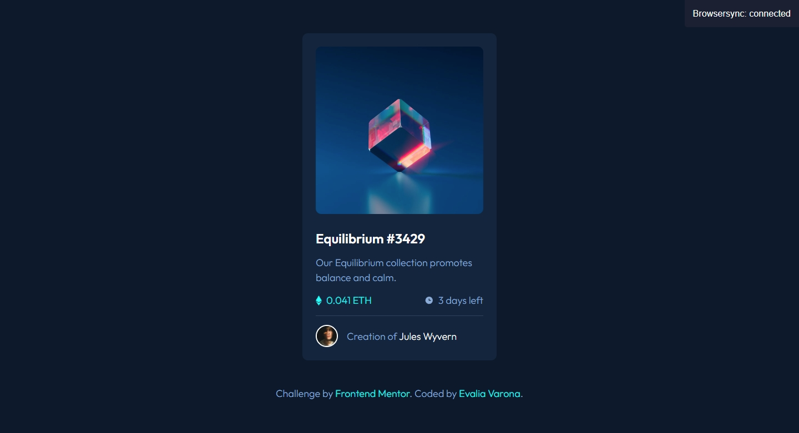

# Frontend Mentor - NFT preview card component solution

This is a solution to the [NFT preview card component challenge on Frontend Mentor](https://www.frontendmentor.io/challenges/nft-preview-card-component-SbdUL_w0U). Frontend Mentor challenges help you improve your coding skills by building realistic projects. 

## Table of contents

- [Overview](#overview)
  - [The challenge](#the-challenge)
  - [Screenshot](#screenshot)
  - [Links](#links)
- [My process](#my-process)
  - [Built with](#built-with)
  - [What I learned](#what-i-learned)
  - [Continued development](#continued-development)
- [Author](#author)

## Overview

### The challenge

Users should be able to:

- View the optimal layout depending on their device's screen size
- See hover states for interactive elements

### Screenshot

### Links

- Solution URL: [Github Repository](https://github.com/varonalearns/NFT-preview-card-component)
- Live Site URL: [Vercel Live Link](https://nft-preview-card-component-ivory-xi.vercel.app/)

## My process

### Built with

- Semantic HTML5 markup
- CSS custom properties
- Flexbox
- Mobile-first workflow
- [Google Fonts](https://fonts.google.com/)

### What I learned

Something I continue to learn with these practice projects is to always think in components. To think of building these pages out of building blocks. This makes it much easier when adjusting the CSS to be responsive for certain views and screen resolutions.  

### Continued development

I want to continue to learn how to better compartmentalize certain features going forward. I am happy with the end result but, as a novice, I always know there is room for improvement. In particular, I should look more into overlaying elements over other elements because that was a bit of a challenge for me when working on this project - show an active state. 

## Author

- Website - [Evalia Varona](https://www.evaliavarona.com)
- Frontend Mentor - [@varonalearns](https://www.frontendmentor.io/profile/varonalearns)
